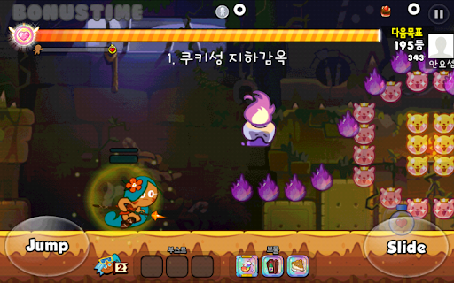
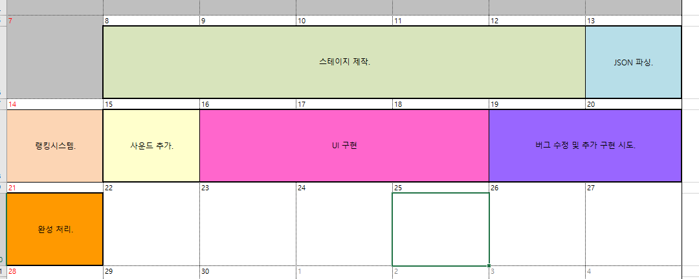

# 2020년도 1학기 안드로이드 게임 프로그래밍.
---
## 안드로이드 게임 프로그래밍 텀프로젝트.

엔컴 2016184041 차지환 

### 목적
유니티 등의 상용엔진을 사용하지 않고 안드로이드의 기본적인 시스템 API를 이용하고 수업시간에 학습한 내용을 위주로 2D게임을 만든다.

##### 게임 내용.

0. 큰 목적 
달리면서 오브젝트들을 먹으면서 점수를 획득하고 기록을 측정하는 게임.

1. 기본 룰 
게임이 시작되면 우측으로 플레이어 캐릭터가 우측으로 달리면서 진행하는 게임이다.

1.  지형 지물  
플레이거가 장애물등에 부딪혀 체력이 다닳면 죽고 게임을 다시 시작해야 한다.

1. 아이템 
맵상에 존재하는 아이템 오브젝트 들이 잇으며 기본적인 아이템은 점수 추가와
스킬 게이지를 올려주는 아이템.

1. 스킬 
스킬 사용시 거대화, 무적의 버프등을 걸어 게임 플레이가 원할하게되는 효과 위주로 제작 에정.
 

##### 비슷한 게임.
 
쿠키런.

##### 필요한 기술
무한 스크롤링, 충돌 처리, 2d 게임 프레임 워크, 애니메이션, FSM, UI, JSON 처리 등등 

### 세부 일정
 

### 현재까지 진행된 사항.

박스 오브젝트를 이용한 충돌처리.
애니메이션은 추가 완료. 
오브젝트 제작은 필요한 모든 오브젝트는 하지 못했고 각 오브젝트 분류(player, item, obstacle, terraing, bg) 별로 한종류 이상씩 제작함. 
FSM 제작 완료. JSON 파싱 기능 및 랭킹 기능이 추가 되었고 아직 적용은 안시켰습니다.
기초 UI가 추가 되었습니다.
스테이지 오브젝트 배치 수정하고 있습니다. 

### 고려 되는 부분.

각 기기별 해상도에 맞게 처리하는 부분.

### 진행 사항 및 할일.
- [x] 리소스 구하기. 
- [x] 터치 키.
- [x] 충돌 처리.
- [x] FSM.
- [x] 애니메이션.
- [x] 오브젝트 제작.

- [x] 스테이지 제작.
- [x] 무한 스크롤링.
- [x] json 파싱.
- [x] 랭킹 시스템.

- [x] UI 구현.
- [ ] 사운드.
### 가능하다면
- [ ] 네트워크 멀티플레이 기능.

### 주차별 계획
- 1주차 ( 6/1 ~ 6/7)
    FSM 완성.   
    터치 키.
    애니메이션.
    충돌처리.
    오브젝트 제작. ( 기본 오브젝트 한종류씩 제작.)
    
- 2주차 ( 6/8 ~ 6/14)
    스테이지 제작.
    무한 스크롤링.
    랭킹 시스템.
    json 파싱.
    

- 3주차 ( 6/15 ~ 6/21)
    사운드 추가.
    UI 구현.            
    추가 사항 구현 시도.
    버그 수정 및 완성.  
    

##### 클래스 역할

* Layer   
각 Scene의 렌더링 깊이를 나누기 위한 클래스.

* GameObject   
각 객체들의 기본이 되는 클래스.

* Cookie  
플레이어 객체 클래스.

* Item  
아이템 Base 클래스.

* Terrain  
장애물류의 Base 클래스.

* ColisionHelper   
충돌체들의 충돌을 처리함.

* Event 
시간 조건등의 상황에따라 실행 되는 클래스.

* EventManager  
이벤트 관리자 클래스.

* RecyclePool   
오브젝트 풀.

* UI
UI관련 Base 클래스 

* Joystick
UI관련 Base 클래스 

* GarbageManager   
프레임워크의 객체 소멸을 관리.

* ScoreManager   
점수 관리

---
가능하다면 추가 되는 부분으로 

* Room  
플레이어들의 게임 단위.

* Session  
플레이어의 연결 관리.

